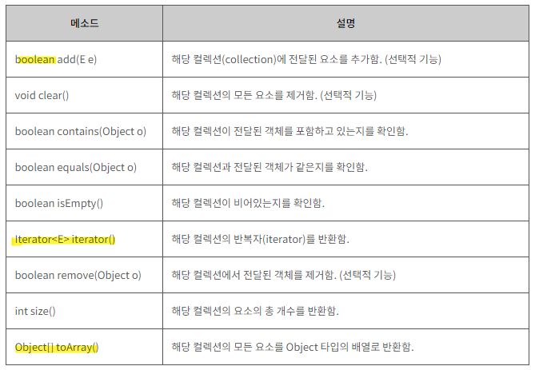
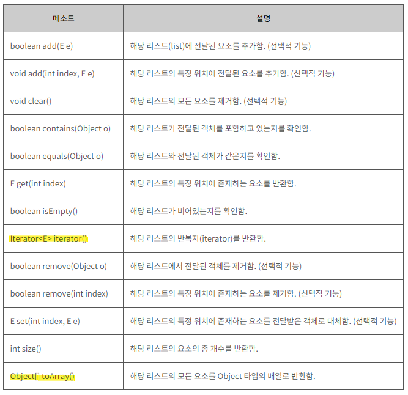

| created    | title     | author         | category |
|------------|-----------|-----------------|----------|
| 2024-01-15 | 컬렉션 프레임워크 | 한의정  | JAVA     |

## 컬렉션 프레임워크
    다수의 데이터를 쉽고 효과적으로 처리하는 표준화된 방법을 제공하는 클래스의 집합

 

### 📌 컬렉션 프레임워크와 핵심 인터페이스
| 인터페이스 |  순서 | 중복                                  |구현 클래스                                    |
|-------|-------------------------------------------|----|-------------------------------------|
| List  |  O  | O                                   |ArrayList, LinkedList, Stack, Vector 등    |
| Set   |  X  | X                                   |HashSet, TreeSet 등                        |
| Map   |  X  | - 키 (key) : X   - 값 (value) : O |HashMap, TreeMap, HashTable, Properties 등 |

 

#### 1. Collection 인터페이스
- List와 Set의 조상 인터페이스
- Vector, Hashtable 같은 기존 컬렉션 클래스들은 되도록 사용하지 말자. (ArrayList, HashMap 권장)

#### 2. List 인터페이스
    중복 O, 저장 순서 유지

#### 3. Set 인터페이스
    중복 X, 저장 순서 유지 X
- 구현 클래스 : HashSet, TreeSet 
#### 4. Map 인터페이스
    key와 value를 한 쌍으로 묶어 저장하는 컬렉션 클래스 구현에 사용
- key 중복 X, value 중복 O
- 중복된 (키, 값) 저장하면 마지막에 저장된 값으로 갱신

| 메소드            | 설명                                                      |
|----------------|---------------------------------------------------------|
| Set entrySet() | Map에 저장된 key-value 쌍을 Map.Entry 타입의 객체로 저장한 **Set으로 반환** | 
| Set keySet()   | Map에 저장된 모든 key 객체 **Set으로 반환**   (key는 중복X므로 Set 타입 반환)                                                        |
| Collection values()            | Map에 저장된 모든 value 객체 반환   (value는 중복 허용하므로 Collection으로 반환)                                                       | 
| boolean equals(Obejct o) | 동일한 Map인지 확인 | 

- **Map.Entry 인터페이스**
  - Map인터페이스 내부 인터페이스

| 메소드                           | 설명                          |
|-------------------------------|-----------------------------|
| boolean equals(Object o)      | 동일한 Entry인지 비교              | 
| Object getKey()               | Entry의 key 객체 반환            |
| Object getValue()             | Entry의 value 객체 반환          |
| Object setValue(Object value) | Entry의 value 객체를 지정된 객체로 변환 |

 

### 📌 ArrayList
    중복 X, 저장 순서 유지
- 생성 시, 실제 저장할 갯수보다 약간 여유 있는 크기로 하는 것이 좋다.

| 메소드                               | 설명                                    |
|-----------------------------------|---------------------------------------|
| boolean add(Object o)             | ArrayList 마지막에 객체 추가. 성공하면 true 반환    | 
| void add(int idx, Object element) | 지정된 위치 (idx)에 객체 저장                   |
| Object clone()                    | ArrayList 복제                          |
| Iterator iterator()               | ArrayList의 Iterator 객체 반환             |
| Object remove(int idx)            | 지정 객체 제거 (성공하면 true, 실패하면 false)      |
| Object[] toArray()                | ArrayList에 저장된 모든 객체들을 객체 배열로 반환      |
| Object[] toArray(Object[] a)      | ArrayList에 저장된 모든 객체들을 객체 배열 a에 담아 반환 |
---

	
2. List 인터페이스
	+ **중복을 허용하며 저장 순서가 유지됨**
	+ 예) ArrayList, LinkedList, Vector, Stack
	+ ArrayList 클래스
		+ **내부적으로 Object배열을 이용**
	    + Obejct 배열의 초기 사이즈는 `10`으로 되어 있음
	    + **기존 용량이 다 채워지면 기존의 1.5배를 늘린 새로운 배열로 복사하여 동적으로 크기를 변경함**
	    + ArrayList 기본 생성자를 이용해서 하면 초기에는 `0`으로 배열크기가 생기는데 add() 메서드 사용시 배열크기를 10으로 변경
	    + 중간에 데이터 추가, 삭제시 순서를 다시 변경해줘야 하기 때문에 속도가 느림
	+ LinkedList 클래스
		+ **순차적으로 데이터를 저장하는 것이 아니라 데이터와 노드로 나뉘어져 있어서 노드에 다음 노드의 주소를 저장하는 방식**
		+ 불연속적으로 데이터가 위치해있기 때문에 처음부터 n번째까지 차례대로 따라가야만 n번째 값을 확인 할 수 있음
		+ **LinkedList 자료구조의 낮은 접근성을 높이기 위해서 실제로 doubly circular linked list로 구현되어 있음**
	
		
    
	> ArrayList vs LinkedList
	> + 순차적으로 추가, 삭제하는 경우 : ArrayList
	> + 중간에 데이터를 추가, 삭제하는 경우 : LinkedList
	> + **데이터 개수가 많지 않다면 서로 차이는 없음**

3. Set 인터페이스
	+ **중복을 허용하지 않고 저장 순서도 유지되지 않음** 
	+ 예) HashSet, SortedSet, TreeSet
	+ HashSet
		+ 내부적으로 HashMap을 이용해서 만들어졌음
		+ add() 메서드를 이용해서 중복된 데이터가 추가하면 false를 반환함
	+ TreeSet
		+ 이진 검색 트리 형태로 데이터를 저장함
		> 이진 검색 트리
		> + 각 노드가 최대 2개의 노드만 가질 수 있으며 최상위 노드(root)에서부터 확장하는 자료구조임
	+ LinkedHashSet
		+ HashSet과 다르게 저장 순서까지 유지함

4. Map 인터페이스
	+ **key, value을 이용해서 저장하며 key에 대하여 중복을 허용하지 않음**
	+ 예) HashMap, Hashtable, SortedMap, LinkedHashMap, TreeMap
	> Map.Entry 인터페이스
	> + Map 인터페이스의 내부 인터페이스
	> + key-value 형태를 이루기 위해 내부적으로 사용함
	> + Map 인터페이스 구현체에서 Map.Entry 인터페이스도 같이 구현해야함
	
	 + HashMap
		 + key와 value값을 각각 Object타입으로 저장
	 + TreeMap
		 + 이진검색트리 형태의 Map
	 + Properties
		 + HashMap의 구버전인 HashTable을 상속받아 구현하였음
		 + (String, String)타입의 key-value 형식
		 + **주로 환경설정과 관련된 속성을 저장하는데 사용함**

> Iterator, ListIterator, Enumeration
> + Enumeration : Iterator의 구버전
> + Iterator : 컬렉션 프레임워크에서 저장된 요소를 읽어올때 사용하는 표준 방법
> + ListIterator : Iterator와 비슷한데 양방향 조회 가능, List 인터페이스의 구현체에서만 사용가능

> Comparator vs Comparable
> + Comparable : 기본 정렬기준을 사용하고자 할때 사용(오름차순)
> + Comparator : 오름차순 외에 다른 기준으로 정렬하고자 할때 사용
---
### 🔗 출처 및 참고 자료
- Java의 정석
- [TCP SCHOOL](https://www.tcpschool.com/java/java_collectionFramework_concept)
- https://recordsoflife.tistory.com/582
- https://junghyungil.tistory.com/96

