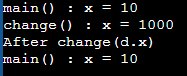
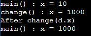

 

### 1. 객체 지향 언어
   > 특징 : 재사용성, 유지보수, 중복 코드 제거

 

### 2. 클래스와 객체

| 용어    | 설명               |
|-------|------------------|
| **클래스**   | 객체 설계도           |
| **인스턴스화** | 클래스로부터 객체 만드는 과정 |
| **인스턴스**  | 클래스로부터 만들어진 객체   |

▷ 클래스 ⊃ 객체 ⊃ 인스턴스

 

#### ◾ 객체
> 구성 요소 : 속성, 기능 (= **변수, 메소드**)

 

#### ◾ 인스턴스 생성과 사용
      
     클래스명 변수명;          // 클래스 객체 참조 위한 참조변수 선언
     변수명 = new 클래스명();  // 클래스 객체 생성 후, 객체 주소를 참조 변수에 저장
▷ 인스턴스는 참조변수 통해서만 다룰 수 있으며, <code>**참조변수 타입 = 인스턴스 타입**</code>이어야 한다.  
➕ **_가비지 컬렉터_**, 자신 참조하는 참조변수가 하나도 없는 인스턴스는 자동으로 메모리에서 제거

 

**◾ 객체 배열**
      
    TV[] tvArr = new TV[3];   // 객체 배열 생성

    // 1) 배열 초기화 블럭 사용해 배열 초기화
    tvArr = {new TV(), new TV(), new TV()};

    // 2) for문 사용해 배열 초기화
    for(int i = 0 ; i < tvArr.length ; i++) {
        tvArr[i] = new TV();
    }

 

**◾ 클래스**
- 변수 → 배열 → 구조체 → **클래스**

   | 용어      |설명                                  |
   |---------|------------------------------------|
   | **변수**  | 하나의 데이터 저장                          |
   | **배열**  | 같은 종류의 여러 데이터를 하나의 집합으로 저장          |
   | **구조체** | 서로 관련된 여러 데이터를 종류에 관계없이 하나의 집합으로 저장 |
   | **클래스** | 데이터 + 함수 (구조체 + 함수)                 |

 

### 3. 변수와 메소드

#### ◾ 변수

  | 변수 종류     | 선언 위치                                  | 생성 시기           |
  |-----------|----------------------------------------|-----------------|
  | **클래스 변수**    | 클래스 영역                                 | 클래스가 메모리에 올라갈 때 |
  | **인스턴스 변수** | 클래스 영역                                 | 인스턴스 생성 시       |
  | **지역 변수**   | 클래스 영역 外 영역   (메소드, 생성자, 초기화 블럭 내부) | 변수 선언문 수행 시     |

 &nbsp;&nbsp; ① **클래스 변수**   &nbsp;&nbsp;→ **<code>static</code>** 붙음  &nbsp;&nbsp;→ 모든 인스턴스가 **공통된** 변수(저장공간) 보유  &nbsp;&nbsp;→ 객체 생성 없이, <code>'클래스명.클래스변수'</code>로 직접 사용 가능
 &nbsp;&nbsp;→ [생성] 클래스가 메모리에 로딩될 때  / [종료] 프로그램 종료 시까지 유지

&nbsp;&nbsp; ② **인스턴스 변수**   &nbsp;&nbsp;→ 인스턴스마다 다른 값 가지는 속성인 경우 사용

&nbsp;&nbsp; ③ **지역 변수**  &nbsp;&nbsp;→ 메소드 내에 선언되어 메소드 내에서만 사용 가능  
 

#### ◾ 메소드
> 특정 작업 수행하는 일련의 문장들을 하나로 묶은 것
- 내부가 보이지 않는 '블랙박스'
- 사용 이유 : ① 재사용성, ② 중복 코드 제거, ③ 프로그램 구조화
- 선언과 구현
   1) **선언부**, 반환타입 메소드명 매개변수선언(입력) 
   2) **구현부**, return 시, 반환 타입과 일치하거나 자동 형변환 가능한 **단 하나의 값**만 반환 가능

- return문, 현재 실행중인 메소드 종료하고 호출한 메소드로 돌아감.
- 매개변수 유효성 검사 잊지 않기

 

#### ◾ JVM의 메모리 구조
1. **메소드 영역** 
    - 프로그램 실행 중 사용되는 클래스의 클래스 파일(.class)을 읽고 분석해 **클래스에 대한 정보(클래스 데이터)**를 저장하는 영역
    - 클래스의 **클래스 변수**도 이 영역에 함께 생성됨.
    
2. **힙**

   - **인스턴스 / 인스턴스 변수들**이 생성되는 공간 
   
3. **호출 스택**

   - 작업에 필요한 메모리 공간 제공
   - 작업 종료 시, 할당되었던 메모리 공간은 반환하고 스택에서 제거됨
   - 맨 위 메소드 = 현재 실행 중인 메소드

 

#### ◾ 기본형 vs 참조형 매개 변수
- **기본형** : 값 읽기만 → **_read only_**
- **참조형** : 인스턴스 주소 복사해 값 변경 가능 → **_read & write_**

기본형 매개변수 예제 코드

      class Data {int x;}

      class Main {
         public static void main(String[] args) {
            Data d = new Data();
            d.x = 10;
            System.out.println("main() : x = " + d.x);   // 출력 : main() : x = 10

            change(d.x);                                 // 출력 : change() : x = 1000
            System.out.println("After change(d.x)");     // 출력 : After change(d.x) 
            System.out.println("main() : x = " + d.x);   // 출력 : main() : x = 10
         }

         // 기본형 매개변수
         static void change(int x) {
            x = 1000;
            System.out.println("change() : x = " + x);
         }
      }

 

참조형 매개변수 예제 코드

      class Data {int x;}

      class Main {
         public static void main(String[] args) {
            Data d = new Data();
            d.x = 10;
            System.out.println("main() : x = " + d.x);   // 출력 : main() : x = 10

            change(d);                                   // 출력 : change() : x = 1000
            System.out.println("After change(d)");       // 출력 : After change(d) 
            System.out.println("main() : x = " + d.x);   // 출력 : main() : x = 1000
         }

         // 참조형 매개변수
         static void change(Data d) {
            d.x = 1000;
            System.out.println("change() : x = " + d.x);
         }
      }

(~3.8)

 

### 4. 오버로딩
### 5. 생성자
### 6. 변수의 초기화

 

---
### 🔗 출처 및 참고 자료
- [Java의 정석 3판](https://www.yes24.com/Product/Goods/24259565)
- [마크다운 형광펜](https://geniewishescometrue.tistory.com/entry/%EB%A7%88%ED%81%AC%EB%8B%A4%EC%9A%B4-%EA%B4%80%EB%A0%A8-%ED%8C%81-%EA%B8%80-%EC%83%89%EC%83%81-%ED%98%95%EA%B4%91%ED%8E%9C)
- [마크다운 표 만들기](https://inasie.github.io/it%EC%9D%BC%EB%B0%98/%EB%A7%88%ED%81%AC%EB%8B%A4%EC%9A%B4-%ED%91%9C-%EB%A7%8C%EB%93%A4%EA%B8%B0/)
- [마크다운 토글](https://computer-science-student.tistory.com/388)
