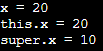
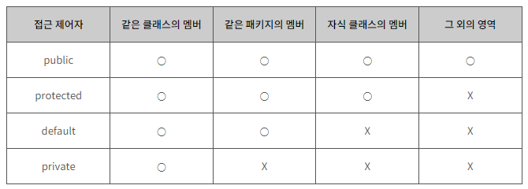

| created    | title         | author         | category |
|------------|---------------|-----------------|----------|
| 2023-12-21 | 객체 지향 프로그래밍 2 | 한의정  | JAVA     |

 

### 1. 상속
> 기존 클래스를 재사용해 새로운 클래스 작성
- <code>**extends**</code>
- **장점** : 코드 재사용성 높이고, 중복 제거해 프로그램 생산성과 유지보수에 기여

| 용어         |                                                                       |
|------------|-------------------------------------------------------------------------|
| **조상 클래스** | 부모(parent) 클래스, 상위(super) 클래스, 기반(base) 클래스                             |
| **자손 클래스** | 자식(child) 클래스, &nbsp; &nbsp;하위(sub) 클래스, &nbsp; &nbsp; 파생된(derived) 클래스 |

    class Parent { }               // 조상 클래스 : 상속해주는 클래스
    class Child extends Parnet { } // 자식 클래스 : 상속 받는 클래스

- 생성자와 초기화 블럭은 상속X. 멤버만 상속된다.
- 자손 클래스의 멤버 개수, 조상 클래스보다 항상 같거나 많다.
- 자손 클래스 인스턴스 생성하면 조상 클래스의 멤버와 자손 클래스의 멤버가 합쳐진 하나의 인스턴스로 생성된다.

 

#### ◾ 클래스 간 관계 - 포함 관계 (Composite)
> 한 클래스의 멤버변수로 다른 클래스 타입의 참조변수를 선언하는 것

포함 관계 예제 코드 : Point 클래스 재사용해 Circle 클래스 작성

      class Point {
          int x,y; // x좌표, y좌표
      }

      class Circle {
          Point c = new Point(); // 원점
          int r;
      }

- 장점 : 단위 클래스 별로 코드 작성 시, 코드가 간결해 이해하기 쉽고, 관리도 수월하다.

 

#### ◾ 클래스 간 관계 결정하기
> - 상속 관계 : `~은 ~이다` (**is - a**)
> - 포함 관계 : `~은 ~을 가지고 있다` (**has - a**)

    class Circle extends Shape {  // Class와 Shape는 상속관계
        Point center;             // Class와 Point는 포함관계
        int r;
        ...
    }

 

#### ◾ 단일 상속 (single inheritance)

- 조상 클래스는 하나
- 클래스 간 관계가 명확해지고, 코드 신뢰성 증가

 

#### ◾ Object 클래스 - 모든 클래스의 조상

- 최상위 조상 클래스
- toString(), equals() 등 메소드 포함

 

### 2. 오버라이딩 (Overriding)
> 조상 클래스로부터 상속받은 메소드 내용을 자손 클래스 자신에 맞게 변경하는 것

#### ◾ 조건
> 자손 클래스에서 오버라이딩하는 메소드는 조상 클래스의 메소드와
>   - **이름**이   &nbsp; &nbsp; &nbsp; 같아야 한다.
>   - **매개변수**가 같아야 한다.
>   - **반환타입**이 같아야 한다.

접근 제어자와 예외는 <u>제한된 조건 하에서만</u> 다르게 변경 가능
1. 접근 제어자, 조상 클래스의 메소드보다 좁은 범위로 변경 불가
   

   
접근 제어자 접근 점위

   &nbsp;&nbsp;: public > protected > (default) > private
   

2. 조상 클래스의 메소드보다 많은 수의 예외 선언 불가
3. 인스턴스 메소드를 static 메소드 또는 그 반대로 변경 불가

 

#### ◾ 오버로딩 vs 오버라이딩 ⭐
- **오버로딩**&nbsp; &nbsp; &nbsp;: 기존에 없는 새 메소드 정의 (new)
- **오버라이딩** : 상속받은 메소드 내용 변경 (change, modify)

 

#### ◾ super
> 자손 클래스에서 조상 클래스로부터 상속받은 멤버를 참조하는 데 사용되는 참조 변수
- vs this : super는 조상의 멤버와 자신의 멤버를 구별하는 데 사용.
- static 메소드에서는 사용할 수 없고, 인스턴스 메소드에서만 사용 가능

   

   
예제 : SuperTest2.java

  
      class SuperTest2 {
         public static void main(String[] args) {
             Child c = new Childe();
             c.method();
         }
      }

      class Parent {
         int x = 10;
      }

      class Child extends Parent {
         int x = 20;

         void method() {
            System.out.println("x = " + x);              // x = 20
            System.out.println("this.x = " + this.x);    // this.x = 20
            System.out.println("super.x = " + super.x);  // super.x = 10
         }
      }

   
   
   

 
  | 용어    | 설명                   |
  |-------|----------------------|
  | **super.x**   | 조상 클래스로부터 상속받은 멤버 변수 |
  | **this.x** | 자손 클래스에서 선언된 멤버 변수   |

- 조상 클래스의 메소드를 자손 클래스에서 오버라이딩한 경우 super사용

 

#### ◾ super() - 조상 클래스의 생성자
   

   
this() vs super()

   this()는 같은 클래스의 다른 생성자를 호출하는 데 사용되지만, super()는 조상 클래스의 생성자를 호출하는 데 사용
   

- 모든 클래스의 생성자, 첫 줄에 만드시 자신의 다른 생성자 <code>**this()**</code> / 조상의 생성자 <code>**super()**</code> 호출해야 함. 그렇지 않으면 컴파일러가 자동으로 <code>**super();**</code> 추가
- 생성자, 선택한 클래스의 어떤 생성자를 이용해 인스턴스를 생성할 것인가?
- **조상 클래스의 멤버변수, 조상의 생성자에 의해 초기화되도록 해야 한다.**
 

### 3. package와 import
#### ◾ 패키지
> 클래스의 묶음. 클래스/인터페이스 포함
- 하나의 소스 파일에 단 한 번만 선언 가능 (맨 첫 번째 문장)  
- 같은 이름의 클래스일지라도 서로 다른 패키지에 속하면 패키지명으로 구별 가능  
- 물리적으로 클래스 파일(.class)를 포함하는 하나의 디렉토리
- 모든 클래스, 반드시 하나의 패키지에 속해야만 
  

- 과정 : 컴파일러, 디렉토리(클래스 파일) 생성 → 패키지의 루트 디렉토리, 클래스에 포함 (클래스패스에 추가) → JVM이 클래스 찾고 실행
- 실행 방법
  1. 클래스 추가 → <code>JDK설치디렉토리\jre\classes</code>
  2. jar 파일 추가 → <code>JDK설치디렉토리\jre\lib\ext</code>
  3. 일시적 클래스 패스 지정 → <code>java <b>-cp</b> c:\jdk1.8\work com.javachobo.book.Package</code>
 

#### ◾ import문
-  컴파일러에게 소스 파일에 사용된 클래스의 패키지에 대한 정보 제공

#### ◾ static import문
- static 멤버 호출 시, 클래스 이름 생략 가능

      import static java.lang.Integer.*;   // Integer클래스의 모든 static 메소드
      import static java.lang.Math.random; // Math.random()만. 괄호 안 붙임
      import static java.lang.System.out;  // System.out을 out만으로 참조 가능

> System.out.println(Math.random()) ↔ out.println(random());

 

### 4. 제어자 (modifier)
> 클래스, 변수, 메소드 선언부에 사용되어 부가적 의미 부여하는 키워드
 

- 종류
  1. 접근 제어자 : public, protected, default, private  
  2. 기타 제어자 : static, final, abstract, native, transient, synchronized, volatile, ...

- 접근 제어자, 한 번에 하나만 선택해 사용 가능 !!
 

#### ◾ static
- _'클래스의', '공통적인'_
- 사용되는 곳 : 멤버 변수, 메소드 초기화 블럭
   

   
예

       
      class StaticTest {
        static int width = 200;         // 클래스 변수 (static 변수)
        static int height = 120;        // 클래스 변수 (static 변수)
        
        static {                        // 클래스 초기화 블럭
          // static 변수의 복잡한 초기화 수행
        }

        static int max(int a, int b) {  // 클래스 메소드 (static 메소드)
          return a > b ? a : b;
        }
      }
   

 

#### ◾ final
- _'마지막의', '변경될 수 없는'_
- 사용되는 곳 : 클래스, 메소드, 멤버변수, 지역변수
    - 클래스 → 변경/확장 불가. (상속 불가)
    - 메소드 → 변경 불가. 오버라이딩 통한 재정의 불가
    - 멤버변수, 지역변수 → 변경 불가
- 생성자 활용한 final 멤버변수의 초기화
   

   
예

  
      class Card {
        final int NUMBER;   // 생성자에서 단 한 번만 초기화
        final String KIND;
        static int width = 100;
        static int height = 250;
  
        // 매개변수로 넘겨받은 값으로 KIND와 NUMBER 초기화
        Card(String kind, int num) {
          KIND = kind;
          NUMBER = num;
        }
      }
     

 

#### ◾ abstract
- _'추상의', '미완성의'_
- 메소드 선언부만 작성하고 실제 수행내용은 구현하지 않은 추상 메소드를 선언하는 데 사용
- 사용되는 곳 : 클래스, 메소드
- 인스턴스 생성 불가
- 장점 : 다른 클래스가 이 클래스를 상속받아 일부 원하는 메소드만 오버라이딩 가능

 

#### ◾ 접근 제어자 (access modifier)
> 멤버/클래스에 사용되어, 해당하는 멤버 또는 클래스를 외부에서 접근하지 못하도록 제한하는 역할
- 사용되는 곳 : 클래스, 멤버변수, 메소드, 생성자
- <code>public</code> > <code>protected</code> > <code>(default)</code> > <code>private</code>

 [(출처)](https://tcpschool.com/java/java_modifier_accessModifier)
 
 

#### ◾ 접근 제어자를 이용한 캡슐화
- 목적 : 외부로부터 클래스 내부에 선언된 데이터 보호하기 위함 (유효값 유지, 데이터 변경 막기 등)
- 접근 범위 최소화
- Getter / Setter
 
➕ 하나의 소스파일(.java)에는 public 클래스가 단 하나만 존재할 수 있고, 소스파일의 이름은 반드시 public 클래스의 이름과 같아야 함

 

#### ◾ 생성자의 접근 제어자
- 외부에서 인스턴스 생성 제한
- 대신 인스턴스 생성해 반환하는 public 메소드 제공해 외부에서 클래스의 인스턴스 사용하도록 만들 수 있다.   (이 때 메소드는 <code>**public**</code>인 동시에 <code>**static**</code>이어야 함)
   

   
예

        class Singleton {
            ...
            private static Singleton s = new Singleton();
            private Singleton() {
            ...
        }

        // 인스턴스 생성하지 않고도 호출할 수 있어야 하므로 static이어야 함
        public static Singleton getInstance() {
            return s;
        }
        ...
      }
     

 

#### ◾ 제어자의 조합
- 대상에 따라 사용할 수 있는 제어자

| 대상       | 사용 가능한 제어자                         |
|----------|------------------------------------|
| **클래스**  | public, (default), final, abstract |
| **메소드**  | 모든 접근 제어자, final, abstract, static |
| **멤버변수** | 모든 접근 제어자, final, static           |
| **지역변수** | final                              |

- 주의사항
  - 메소드, static과 abstract 함께 사용 ❌
  - 클래스, abstract와 final 동시 사용 ❌
  - abstract 메소드의 접근 제어자가 private일 수 없다.
  - 메소드에 private과 final을 같이 사용할 필요는 없다.

 

### 5. 다형성 (polymorphism)
> 여러 가지 형태를 가질 수 있는 능력  
> = **조상 클래스 타입의 참조 변수**로 **자손 클래스의 인스턴스를 참조할 수 있도록 하는 것**

- 서로 상속관계에 있는 클래스의 경우, 조상 클래스 타입의 참조변수로 자손클래스의 인스턴스 참조 가능
- **참조변수가 사용할 수 있는 멤버 갯수 ≤ 인스턴스 멤버 갯수**

    Tv t = new CaptionTv(); // 조상 타입 참조변수로 자손 인스턴스 참조

 

#### ◾ 참조변수의 형 변환
> 자손타입 → 조상타입 (Up-casting) : 형 변환 생략 가능  
> 자손타입 ← 조상타입 (Down-casting) : 형 변환 생략 불가

   

   
예

    Car car = null;
    FireEngine fe = new FireEngine();
    FireEngine fe2 = null;

    car = fe;               // 업캐스팅. Car = (Car)fe; 에서 형 변환 생략
    fe2 = (FireEngine)car;  // 다운캐스팅. 형 변환 생략 불가
  

 

#### ◾ instanceof 연산자
   
    참조변수 instanceof 타입(클래스명)    

- 참조변수가 참조하고 있는 인스턴스의 실제 타입 확인용
- 반환형 boolean형 (<code>**true**</code> : 형 변환 가능)

 

#### ◾ 참조변수와 인스턴스의 연결
- 조상 클래스의 멤버변수와 같은 이름의 멤버변수를 자손 클래스에서 중복 정의한 경우,  인스턴스 변수는 참조변수 타입에 따라 결과 달라짐

   

   
예

      class BindingTest {
          public static void main(String[] args) {
              Parent p = new Child();
              Child c = new Child();

              System.out.println("p.x = " + p.x);   // p.x = 100
              p.method();                           // Child Method

              System.out.println("c.x = " + c.x);   // c.x = 200
              c.method();                           // Child Method
          }
      }

      class Parent {
          int x = 100;
          
          void method() {
            System.out.println("Parent Method");
          }
      }

      class Child extends Parent {
          int x = 200;
          
          void method() {
            System.out.println("Child Method");
          }
      }
  

 

#### ◾ 여러 종류의 객체를 배열로 다루기
- Vector 클래스, 동적으로 배열 크기를 관리하는 객체 배열

    Vector vector = new Vector();

| 용어                           | 설명                                                 |
|------------------------------|----------------------------------------------------|
| **Vector()**                 | 10개 이상의 객체를 저장할 수 잇는 Vector 인스턴스 생성                |
| boolean **add(Object o)**    | Vector에 객체 추가.  → 추가 성공하면 true, 실패하면 false 반환  |
| boolean **remove(Object o)** | Vector에 저장되어 있는 객체 제거  → 제거 성공하면 true, 실패하면 false 반환 |
| boolean **isEmpty()**        | Vector가 비어있는지 검사  → 비어있으면 true, 아니면 false 반환   |
| Object **get(int idx)**      | 지정된 위치(idx)의 객체 반환                                 |
| int **size()**               | Vector에 저장된 객체 갯수 반환                               |

 

### 6. 추상 클래스 (abstract class)
#### ◾ 추상 클래스

> /* 주석을 통해 어떤 기능 수행 목적으로 작성했는지 설명 */  
> abstract 리턴타입 메소드명();
- "미완성 설계도"
- 미완성 메소드를 포함하고 구현부가 없어 인스턴스 생성 ❌
- 생성자 있어야 한다. [(참고)](https://www.tcpschool.com/java/java_polymorphism_abstract)

 

#### ◾ 추상 메소드
- 선언부만 작성하고 구현부는 구현하지 않고 남겨 둔 것
- **상속** 통해서 자손 클래스의 오버라이딩에 의해서만 완성 가능 (조상 클래스 역할)
- 조상으로부터 상속 받은 추상 메소드 중 하나라도 구현하지 않는다면, 자손 클래스 역시 추상 클래스로 지정해야 한다.

   

   
예

      abstract class Player {  // 추상 클래스
          abstract void play(int pos);      // 추상 메소드
          abstract void stop();             // 추상 메소드
      }

      class AudioPlayer extends Player {
          void play(int pos) { }            // 추상 메소드 구현
          void stop() { }                   // 추상 메소드 구현
      }

      abstract class AbstractPlayer extends Player {
          void play(int pos) {  }           // 추상 메소드 구현
      }
  

 
 

#### ◾ 추상 클래스 작성
> **추상화** : 기존 클래스의 공통 부분을 뽑아내 공통의 조상 클래스 만드는 것  
> **구체화** : 상속을 통해 클래스를 구현, 확장하는 작업

 

 

### 7. 인터페이스
#### ◾ 인터페이스란?
- "기본 설계도" - 구현된 것 없고, 밑그림만 그려짐
- 추상 클래스보다 추상화 정도가 높음.
- **추상 메소드**와 **상수**만을 멤버로 가질 수 있음.

 

#### ◾ 인터페이스 작성

      interface 인터페이스명 {
          public static final 타입 상수이름 = 값;
          public abstract 메소드명(매개변수목록);
      }

- 제약사항
  - 모든 멤버변수는 <code>public static final</code>여야 하며, 생략 가능
  - 모든 메소드는 <code>public abstract</code>여야 하며, 생략 가능

 

#### ◾ 인터페이스 상속
- 인터페이스로부터만 상속받을 수 있음
- 다중상속 가능 (= 여러 인터페이스로부터 상속 받을 수 있음)

 

#### ◾ 인터페이스 구현
> 'implements'

    class 클래스명 implements 인터페이스명 {
        // 인터페이스에 정의된 추상 메소드 구현해야 함
    }

    class Fighter implements Fightable {
        public void move(int x, int y) {}
        public void attack(Unit u) {}
    }

- 구현하는 인터페이스 메소드 중 일부만 구현한다면, abstract 붙여 추상 클래스로 선언해야 함

    abstract class Fighter implements Fightable {
        public void move(int x, int y) {}
    }

- 상속, 구현 동시에 가능!
    

    class Fighter extends Unit implements Fightable {
        public void move(int x, int y) {}
        public void attack(Unit u) {}
    }

- 오버라이딩 시, 조상의 메소드보다 넓은 범위의 접근 제어자 지정해야 함 → 반드시 public으로

 

#### ◾ 인터페이스 이용한 다중상속
- JAVA에서는 허용 X

 

#### ◾ 인터페이스 이용한 다형성
- 인터페이스, 메소드의 매개변수 타입으로 사용 가능

    void attack(Fightable f) {}

- 메소드 호출 시 해당 인터페이스를 구현한 클래스의 인스턴스를 매개변수로 제공해야 한다는 것
- **리턴 타입이 인터페이스 타입 = 메소드가 해당 인터페이스 구현한 클래스의 인스턴스 반환한다는 것** ⭐⭐

 

#### ◾ 인터페이스 장점
> - 개발시간 단축 가능
> - 표준화 가능
> - 서로 관계없는 클래스들에게 관계 맺어줄 수 있음
> - 독립적 프로그래밍 가능

 

#### ◾ 인터페이스의 이해
- 클래스를 사용하는 쪽(User)과 클래스를 제공하는 쪽(Provider)이 있다.
- 메소드를 사용(호출)하는 쪽(User)에서는 사용하려는 메소드(Provider)의 선언부만 알면 된다.

 

#### ◾ 디폴트 메소드와 static 메소드
> 추상 메소드의 기본 구현을 제공하는 메소드
- 디폴트 메소드가 새로 추가되어도 해당 인터페이스 구현한 클래스 변경하지 않아도 됨.
- 인터페이스와 관련된 static 메소드는 별도의 클래스에 따로 두어야 함
- 예 : java.util.Collecion 인터페이스
- 몸통 있어야 함

    interface MyInterface {
        void method();
        default void newMethod();
    }

 

### 8. 내부 클래스 
> 장점
>   - 내부 클래스에서 외부 클래스 멤버들 쉽게 접근 가능
>   - 코드 복잡성 줄일 수 있음 (캡슐화)

 

#### ◾ 익명 클래스
- 클래스 선언과 객체 생성 동시에
- 단 한 번만 사용되며 오직 객체 하나만 생성할 수 있는 일회용 클래스

    new 조상클래스명() {
        // 멤버 선언
    }

    new 구현인터페이스명() {
        // 멤버 선언
    }

 

---
### 🔗 출처 및 참고 자료
- [Java의 정석 3판](https://www.yes24.com/Product/Goods/24259565)
- [TCP SCHOOL](https://tcpschool.com/java/java_modifier_accessModifier)
- [TCP SCHOOL - 생성자](https://www.tcpschool.com/java/java_polymorphism_abstract)