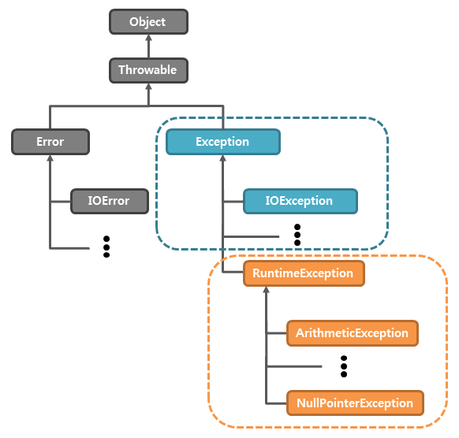

| created    | title | author         | category |
|------------|-------|-----------------|----------|
| 2024-01-04 | 예외처리  | 한의정  | JAVA     |

 

### 1. 예외 처리 (exception handling)
#### ◾ 프로그램 오류
> 프로그램이 오작동하거나 비정상적으로 종료되는 경우

| 용어         | 설명                      |
|------------|-------------------------|
| **컴파일 에러** | 컴파일 시 발생하는 에러           |
| **런타임 에러** | 실행 시 발생하는 에러            |
| **논리적 에러** | 실행은 되지만, 의도와 다르게 동작하는 것 |

- 에러 : 프로그램 코드에 의해 수습할 수 없는 심각한 오류 (메모리 부족, 스택오버플로우)
- 예외 : 프로그램 코드에 의해 수습할 수 있는 다소 미약한 오류

 

#### ◾ 예외 클래스의 계층구조

- **Exception 클래스들**&nbsp;&nbsp;&nbsp;&nbsp;&nbsp;&nbsp;&nbsp;&nbsp;&nbsp;&nbsp;&nbsp;&nbsp;&nbsp;&nbsp; : 외적 요인에 의해 발생하는 예외 (사용자 실수 - 클래스명 잘못 적음, 데이터 형식 잘못 됨)
- **RuntimeException 클래스들** : 프로그래머의 실수로 발생하는 예외 (null, 형변환, 0으로 나누기 등)

 

#### ◾ 예외 처리하기 - try-catch문
- 정의 : 프로그램 실행 시 발생 가능한 예외 발생에 대비한 코드 작성하는 것
- 목적 : 프로그램의 비정상 종료 막고, 정상적 실행상태 유지

    try {
        // 예외 발생할 가능성이 있는 문장들 넣음
    } catch(Exception e1) {
        // Exception1이 발생했을 경우, 이를 처리하기 위한 문장 적음
    } catch(Exception e2) {
        // Exception2이 발생했을 경우, 이를 처리하기 위한 문장 적음
    } catch(Exception eN) {
        // ExceptionN이 발생했을 경우, 이를 처리하기 위한 문장 적음
    }

 

#### ◾ try-catch문의 흐름

- try 블럭 내에서 예외 발생한 경우
  1. 발생한 예외와 일치하는 catch블럭이 있는지 확인
  2. 일치하는 catch 블럭 찾으면, 그 catch 블럭 내의 문장들을 수행하고 있는 전체 try-catch문을 빠져나가 그 다음 문장 계속해서 수행. 만일 일치하는 catch 블럭을 찾지 못하면, 예외 처리 안 됨.

- try블럭 내에서 예외가 발생하지 않은 경우
  - catch블럭을 거치지 않고 전체 try-catch문을 빠져나가 수행 석

 

#### ◾ printStackTrace()와 getMessage()
- **printStackTrace()** : 예외발생 당시 호출스택에 있었던 메소드의 정보와 예외 메시지를 화면에 출력
- **getMessage()** : 발생한 예외클래스의 인스턴스에 저장된 메시지 얻을 수 있음

 

#### ◾ finally 블럭
> 예외 발생 여부에 상관없이 항상 수행
- 예외 발생 시 try → catch → finally (안 발생하면 try → finally)
- try 블럭이나 catch블럭에서 return문이 수행되는 경우에도 finally 블럭의 문장들 먼저 수행 후 현재 실행 중인 메소드 종료

 

#### ◾ 자동 자원 반환 - try-with-resources
- try-with-resources문의 괄호 안에 객체 생성하는 문장 넣으면, 따로 close() 호출하지 않아도 try 블럭 벗어나는 순간 자동적으로 catch 블럭 / finally 블럭 수행
- 단, 클래스가 AutoClosealbe 인터페이스 구현한 것이어야만 함

    public interface AutoCloseable {
        void close() throws Exception;
    }

 

---
### 🔗 출처 및 참고 자료
- [Java의 정석 3판](https://www.yes24.com/Product/Goods/24259565)
- [예외 클래스 이미지 출처](https://tcpschool.com/java/java_exception_class)
- [TCP SCHOOL](https://www.tcpschool.com/java/java_exception_throw)