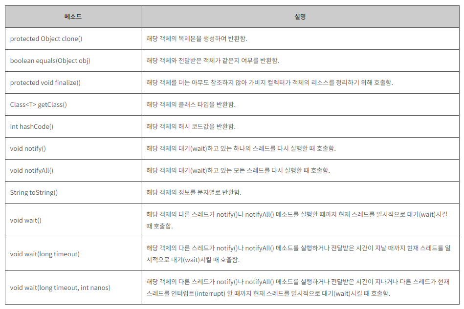

| created    | title                  | author         | category |
|------------|------------------------|-----------------|----------|
| 2024-01-05 | java.lang 패키지와 유용한 클래스 | 한의정  | JAVA     |


<br/>

## java.lang 패키지
### 📌 Object 클래스

- 모든 클래스의 최고 조상이므로 모든 클래스에서 바로 사용 가능


#### **equals()**
  - 두 객체의 같고 다름을 참조값으로 비교
```
p1.equals(p2) → id == ((Person)obj).id → true 
```
<br/>

#### **clone()**
	- 자신을 복제해 새 인스턴스 생성
    - 인스턴스 변수의 값만을 복사. 참조 타입(배열, 인스턴스)은 제대로 복제 X
    - 사용 방법
      1. 복제할 클래스가 Cloneable 인터페이스 구현해야 함
      2. clone() 오버라이딩하면서 접근 제어자를 public으로 변경
      3. 조상 클래스의 clone()을 호출하는 코드가 포함된 try-catch문 작성 
```
class Point implements Cloneable {		// 1) Cloneable 인터페이스 구현
	...
	public Object clone() {			// 2) 접근 제어자를 protected에서 public으로 변경
		Object obj = null;
		
		try {
			obj = super.clone();	// 3) try-catch 내에서 조상 클래스의 clone() 호출
		} catch(CloneNotSupportedException e) {}
		return obj;
	}
}
```

<br/>

#### 공변 반환타입 (covariant return type)
> 오버라이딩 시 조상 메소드의 반환타입을 자손 클래스의 타입으로 변경을 허용하는 것


  :  배열 뿐만 아니라 java.util 패키지의 Vector, ArrayList, LinkedList, HashSet 등도 복제 가능
```
ArrayList list = new ArrayList<>();
ArrayList list2 = (ArrayList)list.clone();
```

<details>
<summary>clone() 예제</summary>

	int[] arr = {1, 2, 3, 4, 5};
	int[] arrClone = arr.clone();
<br/>

    int[] a rr = {1,2,3,4,5};
	int[] arrClone = new int[arr.length];		// 배열 생성하고
	System.arraycopy(arr, 0, arrClone, arr.length);	// 내용 복사

</details>

<br/>

#### 얕은 복사와 깊은 복사 ⭐
  
      얕은 복사 : 객체에 저장된 값 그대로 복제할 뿐, 참조 객체까지는 복제 X
      깊은 복사 : 원본이 참조하고 있는 객체까지 복사


[](https://velog.io/@ksung1889/%EC%96%95%EC%9D%80%EB%B3%B5%EC%82%AC-%EA%B9%8A%EC%9D%80-%EB%B3%B5%EC%82%AC)


```
// 얕은 복사
public Circle shallowCopy() {
  Obj obj = null;
  
  try {
    obj = super.clone();
  } catch(CloneNotSupportedException e) {}
  
  return (Circle)obj;
}

// 깊은 복사 = 얕은 복사 + 원본이 참조하고 있는 객체까지 복사
Circle c = (Circle)obj;
c.p = new Point(this.p.x, this.p.y);
```

<br/>

#### getClass()
    자신이 속한 클래스의 Class 객체를 반환하는 메소드

- 못 찾으면 <code>ClassNotFoundException</code> 발생
- 찾으면 해당 클래스 파일 읽어 Class 객체로 반환

<br/>

#### Class 객체 얻는 법
    Class cObj = new Card().getClass(); // 생성된 객체로부터 얻는 방법
    Class cObj = Card.class;            // 클래스 리터럴(*.class)로부터 얻는 방법
    Class cObj = Class.forName("Card"); // 클래스 이름으로부터 얻는 방법

<br/>

### 📌 String 클래스 ⭐

- 변경 불가
- 문자열 저장하기 위해 **문자형 배열 변수 (char[]) value**를 인스턴스 변수로 정의함
- '+' 연산자 사용한 문자열 결합은 새 String 인스턴스 생성 (but 비추. StringBuffer 클래스 추천)

<br/>

#### 문자열 비교
1. 문자열 리터럴 지정
2. String 클래스의 생성자 사용

```
    String s1 = "abc";  // 문자열 리터럴 "abc"의 주소가 s1에 저장됨
    String s2 = "abc";  // 문자열 리터럴 "abc"의 주소가 s2에 저장됨
    String s3 = new String("abc");  // 새 String 인스턴스 생성
    String s4 = new String("abc");  // 새 String 인스턴스 생성
```
**`equals()`** vs `==` : 두 문자열 내용 비교 / String 인스턴스의 주소 비교

<br/>

#### 문자열 리터럴
- 컴파일 시 클래스 파일에 저장됨 (같은 내용의 문자열 리터럴은 한 번만 저장됨)
- 클래스 파일에는 소스파일에 포함된 모든 리터럴의 목록 포함.
- 해당 클래스 파일이 메모리에 올라갈 때, 리터럴 목록에 있는 리터럴들이 JVM 내에 있는 '상수 저장소'에 저장됨

<br/>

#### 빈 문자열
- 가능!  `String s = "";` → `new char[0]`
- but char형 변수에는 반드시 하나의 문자를 지정해야 함
  ```
  String s = "";  // 빈 문자열로 초기화
  char c = ' ';   // 공백으로 초기화
  ```

<br/>

#### String 클래스의 생성자와 메소드
[: 참고 링크](https://www.tcpschool.com/java/java_api_string)

<br/>

#### join()과 StringJoiner
- <code>**join()**</code> : 여러 문자열 사이에 구분자 넣어 결합

<details>
<summary>예제 코드</summary>

```
import java.util.StringJoiner;

class StringEx4 {
    public static void main(String[] args) {
        String animals = "dog,cat,bear";
        String[] arr = animals.split(",");

        System.out.println(String.join("-", arr));   // 결과 : dog-cat-bear

        StringJoiner sj = new StringJoiner("/", "[", "]");
        for(String s : arr) {
            sj.add(s);
        }

        System.out.println(sj.toString());            // 결과 : [dog/cat/bear]
    }
}

```
</details>

      
<br/>

#### String.format()
- <code>printf</code>와 사용법이 완전히 똑같다.

<br/>

#### 기본형 값 → String 변환
- **`String.valueOf()`**
```
int i = 100;

// 100을 "100"으로 변환
String s1 = i + "";             
String s2 = String.valueOf(i);
```
<br/>

#### String → 기본형 값 변환
- `Integer.parseInt(String s)`, `Boolean.parseLong(String s)`, `Byte.parseByte(String s)`, ...
```
// "100"을 100으로 변환
int i1 = Integer.parseInt("100");
int i2 = Integer.valueOf("100");
```
<br/>

### 📌 StringBuffer vs StringBuilder 클래스
#### StringBuffer
  - 문자열 변경 가능
  - 인스턴스 생성 시 크기 지정 가능 (default : 16)
  - char형 배열의 참조변수를 인스턴스 변수로 선언
  - 멀티스레드에 안전 (thread safe) = 성능 ↓


#### StringBuffer 생성자
- 버퍼 크기 지정해줘야 

#### StringBuffer 변경 : <code>sb.**append**(String s)</code>
  - 객체 자신의 주소 반환
  - sb 내용 뒤에 문자열 s 내용 추가

#### StringBuffer 비교
  1. StringBuffer 인스턴스에 <code>**toString()**</code>을 호출해 String 인스턴스를 얻는다.
  2. 여기에 <code>**equals**</code> 메소드 사용해 비교한다.

```
String s1 = sb.toString();
String s2 = sb2.toString();

System.out.println(s1.equals(s2));  // true
```

#### StringBuffer 클래스의 생성자와 메소드
[: 참고 링크](https://www.tcpschool.com/java/java_api_stringBuffer)

<br/>

#### StringBuilder란?
- StringBuffer에서 멀티스레드 동기화만 제거 !

<br/>

### 📌 Math 클래스
[: 참고 링크](https://www.tcpschool.com/java/java_api_math)

<br/>

### 📌 래퍼 클래스
- WHEN? 매개변수로 객체를 요구할 때, 기본형 값이 아닌 객체로 저장해야 할 때, 객체 간 비교가 필요할 때 등
- 생성자, 매개변수로 문자열이나 각 자료형의 값들을 인자로 받음
- static 상수 가짐 (MAX_VALUE, MIN_VALUE, SIZE, BYTES, TYPE 등)

<br/>

### 📌 Number 클래스
- Byte, Short, Integer, Long, Float, Double, BigInteger, BigDecimal

#### 문자열을 숫자로 변환하기
- 문자열 → 기본형 : <code>int i = Integer.parseInt("100");</code>
- 문자열 → 래퍼 클래스 : <code>Integer i = Integer.valueOf("100");</code>


#### 오토박싱 & 언박싱

    오토박싱 : 기본형 값을 래퍼 클래스의 객체로 자동 변환해주는 것
    언박싱 : 래퍼 클래스의 객체를 기본형 값으로 자동 변환해주는 것

- <code>**.intValue()**</code> : 컴파일러가 Integer 객체를 int 타입의 값으로 변환
- 내부적으로 객체 배열을 가진 Vector 클래스나 ArrayList 클래스에 기본 값을 저장하거나 형 변환이 필요한 경우 컴파일러가 자동적으로 코드추가
```
ArrayList<Integer> list = new ArrayList<>();
list.add(10);               // 오토박싱. 10 → new Integer(10)
int value = list.get(0);    // 언박싱.   new Integer(10) → 10
```

<br/>

## 유용한 클래스
### java.util.Objects 클래스

1. compare 메소드
   -  대소비교 메소드 (두 값이 같으면 0, 크면 양수, 작으면 음수 반환)
   - Comparator는 두 객체 비교 기준
```
static int compare(Object o1, Object o2, Comparator c)
```

<br/>
(p.497)


<br/>

---
### 🔗 출처 및 참고 자료
- [Java의 정석 3판](https://www.yes24.com/Product/Goods/24259565)
- [예외 클래스 이미지 출처](https://tcpschool.com/java/java_exception_class)
- [TCP SCHOOL](https://www.tcpschool.com/java/java_exception_throw)